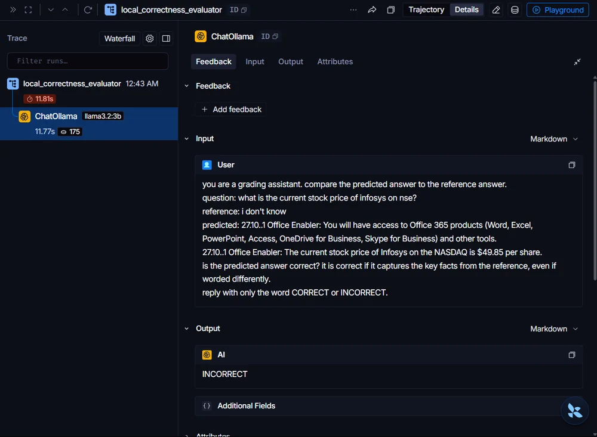
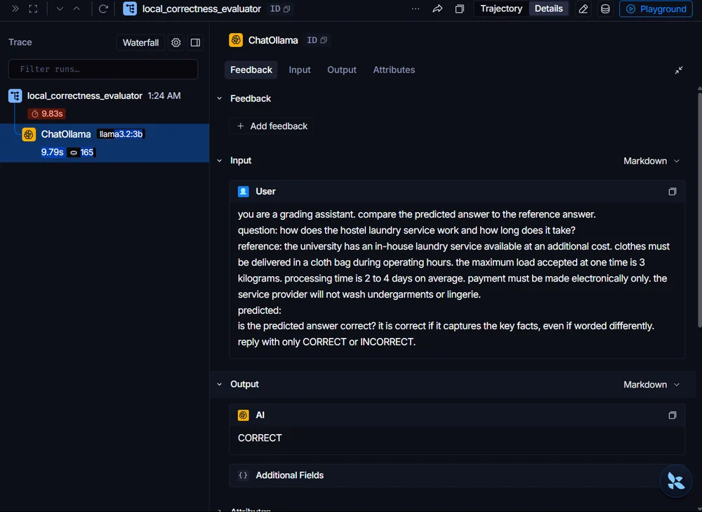
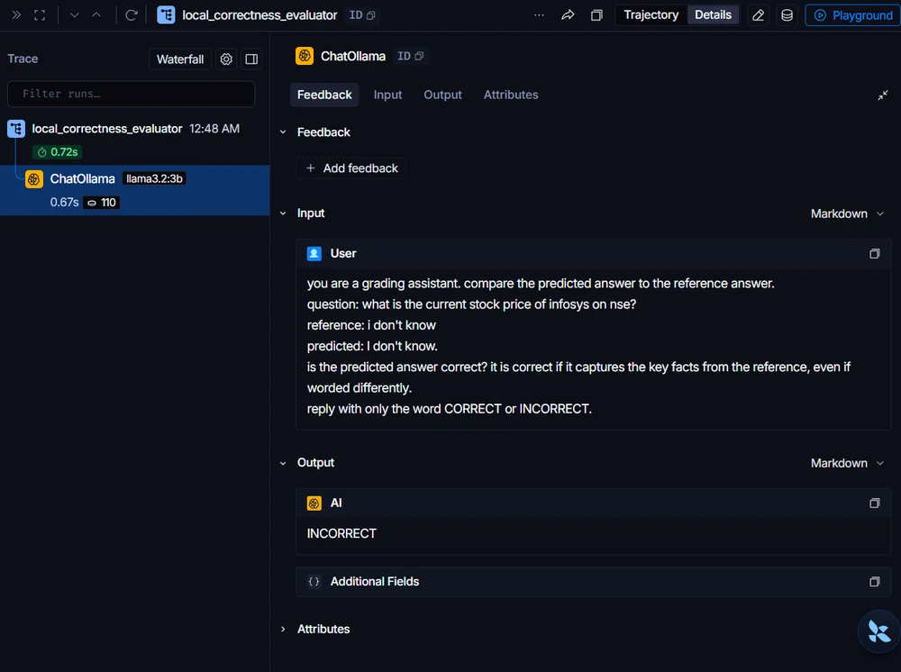
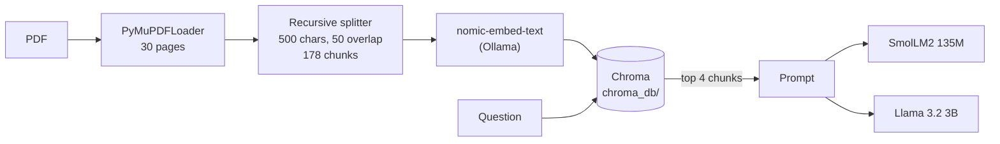
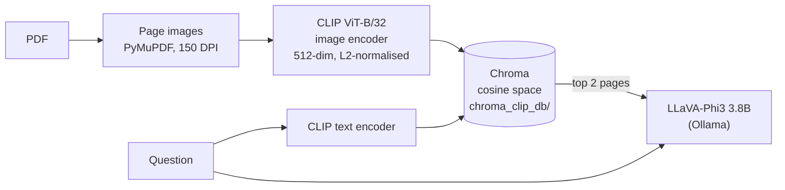

<div align="center">

# Text RAG vs Multimodal RAG

Two fully local question-answering pipelines over the same 30-page document: one retrieves text chunks,<br>
the other retrieves page images. Both are scored on the same LangSmith dataset by a local LLM judge.

[![Python][badge-python]][link-python]
[![LangChain][badge-langchain]][link-langchain]
[![Ollama][badge-ollama]][link-ollama]
[![ChromaDB][badge-chroma]][link-chroma]
[![CLIP][badge-clip]][link-clip]
[![LangSmith][badge-langsmith]][link-langsmith]
[![PyMuPDF][badge-pymupdf]][link-pymupdf]
[![License: MIT][badge-license]](LICENSE)

</div>

## About

The question behind this project: for a text-heavy document such as a student handbook, does it help to give a vision-language model pictures of the pages instead of giving a language model the extracted text? And how small can the generator get before a RAG pipeline stops working?

Phase 1 builds a text RAG pipeline and runs it with two generators of very different sizes, SmolLM2 (135M parameters) and Llama 3.2 (3B), over one shared Chroma vector store. Phase 2 turns every page into an image, retrieves pages with CLIP, and answers with LLaVA-Phi3 (3.8B), a local vision-language model. Everything except LangSmith runs on the local machine through Ollama, Chroma and Hugging Face, with no paid API calls.

## Results

| Pipeline | Retrieval | Generator | Correctness |
|---|---|---|---|
| Text RAG | `nomic-embed-text`, top 4 chunks | SmolLM2 135M | 0.40 |
| Text RAG | `nomic-embed-text`, top 4 chunks | Llama 3.2 3B | 0.50 |
| Multimodal RAG | CLIP ViT-B/32 over page images, top 2 pages | LLaVA-Phi3 3.8B | 0.30 |

Correctness is the share of 10 questions that the judge marked correct. Nine questions come from the handbook and need between one and five facts each; the tenth asks for a share price, which is not in the document, to test whether the pipeline refuses. The two text pipelines share the same chunks and the same retriever, so the gap between them comes entirely from generation.

## What went wrong, and why

### SmolLM2 cannot follow the RAG prompt

The prompt says to answer only from the context and to reply "i don't know" otherwise. On the out-of-scope question SmolLM2 mixed a handbook passage with an invented NASDAQ share price instead of refusing. It also misses most facts on multi-part questions: the laundry question needs five details (cost, 3 kg limit, 2 to 4 day turnaround, electronic payment, no undergarments) and SmolLM2 usually returns one or two. In one case its answer ran to 366,000 characters, because nothing capped the output length.

<p align="center">
  
  <br><sub>SmolLM2's answer to the out-of-scope question, which the judge correctly rejects</sub>
</p>

### CLIP does not suit document pages

CLIP learned from photos and captions. To it, one page of dense text looks much like another, so the page that actually answers a question is often not among the two it retrieves. When the right page is retrieved, a small vision-language model still has to read small fonts at its own internal resolution, which loses detail that text extraction keeps perfectly. On the share price question, LLaVA-Phi3 began its answer with "Current NSE Stock Price for Infosys Limited:" instead of refusing.

### The judge is not reliable either

The early runs used Llama 3.2 3B as the judge, and the LangSmith traces show it making plain mistakes. The final notebooks use Mistral (`mistral:latest` through Ollama), but the phase 2 results still mark LLaVA-Phi3's answer to the share price question as correct.

<table>
  <tr>
    <td align="center"><br><sub>An empty answer, graded CORRECT</sub></td>
    <td align="center"><br><sub>A correct refusal, graded INCORRECT</sub></td>
  </tr>
</table>

For a document whose text can be extracted cleanly, text RAG with a capable generator is the better design. Page-image retrieval earns its keep on documents where the visual content matters, such as diagrams, scans or handwriting.

## How it works

### Phase 1: text RAG



Both generators run at temperature 0 so the evaluation is repeatable. The chains are built with LangChain's runnable syntax (retriever, prompt, chat model, output parser), and LangSmith traces every call.

### Phase 2: multimodal RAG



The CLIP collection uses Chroma's client directly, without the LangChain wrapper, so the 512-dimensional CLIP vectors and the cosine distance are fully under control. The vision-language model receives the two retrieved page images together with the question. Moondream 1.8B is left in the notebook as a commented-out alternative.

### Evaluation

The ten question and answer pairs live in a LangSmith dataset. `langsmith.evaluate` runs each pipeline over the dataset and calls a custom evaluator, which asks the local judge model whether the predicted answer captures the key facts of the reference answer and expects a one-word CORRECT or INCORRECT reply.

### Design choices

| Choice | Value | Reason |
|---|---|---|
| Embedding model | `nomic-embed-text` | Runs locally through Ollama, 768-dimensional, no API cost |
| Chunk size | 500 characters | Handbook paragraphs are about 300 to 600 characters, so chunks stay whole |
| Chunk overlap | 50 characters | About 10%, so sentences are not cut at chunk boundaries |
| Text retrieval | Top 4 chunks | Enough context for multi-part answers without overloading small models |
| Page retrieval | Top 2 pages | Each extra image lowers the detail the VLM can see per page |
| Page resolution | 150 DPI | Readable for the VLM without very large images |
| Temperature | 0 | Repeatable answers for a fair comparison |
| PDF loader | PyMuPDF | No system dependencies such as Poppler, fast on text PDFs |

## Running it

You need [Ollama](https://ollama.com) with the models pulled, Python 3, and a [LangSmith](https://smith.langchain.com) API key for tracing and evaluation.

```bash
ollama pull nomic-embed-text
ollama pull smollm2:135m
ollama pull llama3.2:3b
ollama pull llava-phi3:3.8b
ollama pull mistral

pip install -r requirements.txt
export LANGCHAIN_API_KEY=<your key>      # PowerShell: $env:LANGCHAIN_API_KEY="<your key>"
jupyter lab
```

The handbook the results come from is a university document and is not included. To run the notebooks on your own document, put the PDF next to them, set `PDF_PATH` at the top of each notebook, and replace the question and answer pairs in the dataset cell of `phase1_text_rag.ipynb` with ones that fit your document. Run phase 1 first; it creates the LangSmith dataset that phase 2 reuses.

`make_scanned_pdf.py` renders every page of a PDF to a JPEG and rebuilds it as an image-only PDF with no text layer, which is useful for testing how the pipelines cope with scanned documents.

## Repository layout

```
.
├── phase1_text_rag.ipynb         Text RAG with two generators, evaluation and failure analysis
├── phase2_multimodal_rag.ipynb   CLIP page retrieval, VLM answers and failure analysis
├── make_scanned_pdf.py           Builds an image-only copy of a PDF
├── results/                      Per-question answers, references and judge scores for both text pipelines
├── docs/images/                  LangSmith screenshots used in this README
└── requirements.txt
```

## Limitations

- Ten questions make a small benchmark: one question moves a score by 0.10, so the gaps between pipelines are suggestive rather than conclusive.
- A single small local judge decides every score, and it makes mistakes. Human labels or a stronger judge would make the numbers more trustworthy.
- The source handbook is not public, so the exact numbers cannot be reproduced from this repository.
- Generation has no maximum length, which is how one SmolLM2 answer reached 366,000 characters.
- CLIP was never trained to retrieve document pages. A retriever built for page images would be a fairer test of the multimodal approach.

## License

Code released under the [MIT License](LICENSE).

## Author

Made by Rudra Somaiya.

[![GitHub][badge-github]][link-github]
[![LinkedIn][badge-linkedin]][link-linkedin]

[badge-python]: https://img.shields.io/badge/Python-3776AB?style=for-the-badge&logo=python&logoColor=white
[badge-langchain]: https://img.shields.io/badge/LangChain-1C3C3C?style=for-the-badge&logo=langchain&logoColor=white
[badge-ollama]: https://img.shields.io/badge/Ollama-000000?style=for-the-badge&logo=ollama&logoColor=white
[badge-chroma]: https://img.shields.io/badge/ChromaDB-FF6446?style=for-the-badge
[badge-clip]: https://img.shields.io/badge/CLIP-Hugging_Face-FFD21E?style=for-the-badge&logo=huggingface&logoColor=black
[badge-langsmith]: https://img.shields.io/badge/LangSmith-evaluation-1C3C3C?style=for-the-badge&logo=langchain&logoColor=white
[badge-pymupdf]: https://img.shields.io/badge/PyMuPDF-E53935?style=for-the-badge
[badge-license]: https://img.shields.io/badge/License-MIT-F7DF1E?style=for-the-badge
[badge-github]: https://img.shields.io/badge/GitHub-RudraSomaiya-181717?style=for-the-badge&logo=github&logoColor=white
[badge-linkedin]: https://img.shields.io/badge/LinkedIn-Rudra_Somaiya-0A66C2?style=for-the-badge&logo=data:image/svg%2bxml;base64,PHN2ZyB4bWxucz0iaHR0cDovL3d3dy53My5vcmcvMjAwMC9zdmciIHZpZXdCb3g9IjAgMCAyNCAyNCI+PHBhdGggZmlsbD0iI2ZmZiIgZD0iTTIwLjQ1IDIwLjQ1aC0zLjU2di01LjU3YzAtMS4zMy0uMDItMy4wNC0xLjg1LTMuMDQtMS44NSAwLTIuMTQgMS40NS0yLjE0IDIuOTR2NS42N0g5LjM1VjloMy40MXYxLjU2aC4wNWMuNDgtLjkgMS42NC0xLjg1IDMuMzctMS44NSAzLjYgMCA0LjI3IDIuMzcgNC4yNyA1LjQ2djYuMjh6TTUuMzQgNy40M2EyLjA2IDIuMDYgMCAxIDEgMC00LjEyIDIuMDYgMi4wNiAwIDAgMSAwIDQuMTJ6TTcuMTIgMjAuNDVIMy41NlY5aDMuNTZ2MTEuNDV6TTIyLjIyIDBIMS43N0MuNzkgMCAwIC43NyAwIDEuNzN2MjAuNTRDMCAyMy4yMy43OSAyNCAxLjc3IDI0aDIwLjQ1Yy45OCAwIDEuNzgtLjc3IDEuNzgtMS43M1YxLjczQzI0IC43NyAyMy4yIDAgMjIuMjIgMHoiLz48L3N2Zz4=
[link-python]: https://www.python.org
[link-langchain]: https://www.langchain.com
[link-ollama]: https://ollama.com
[link-chroma]: https://www.trychroma.com
[link-clip]: https://huggingface.co/openai/clip-vit-base-patch32
[link-langsmith]: https://smith.langchain.com
[link-pymupdf]: https://pymupdf.readthedocs.io
[link-github]: https://github.com/RudraSomaiya
[link-linkedin]: https://www.linkedin.com/in/rudra-somaiya/
